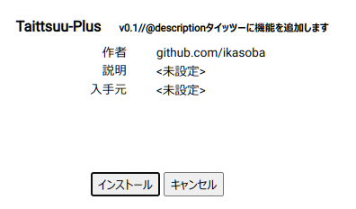

# タイッツー Plus

タイッツー Plus は tampermonkey で動くユーザースクリプトです。
もしかしたら greasemonkey でも動くかもしれないです。

# タイッツー Plus の機能

- リンク

  URL っぽい文字列をリンクへ変換

- メンションリンク

  `@ikasoba000` などの文字をリンクへ変換

- 画像プレビュー

  `.png`や`.webp`などの拡張子が付いた URL を画像として展開

- リタイーツ

# インストール方法

- まず、tampermonkey をブラウザにインストールします。

- 次に tampermonkey のダッシュボードを開きます。
  

- 次にユーティリティタブを開きます。
  

  `URLからインポート`の入力欄へ以下の URL を貼り付け、インストールボタンを押します。

  https://ikasoba.github.io/taittsuu-plus/index.js

- 画面が変わるので、インストールボタンをもう一度押せば完了です！
  
