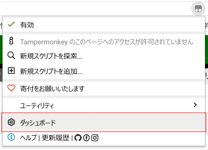
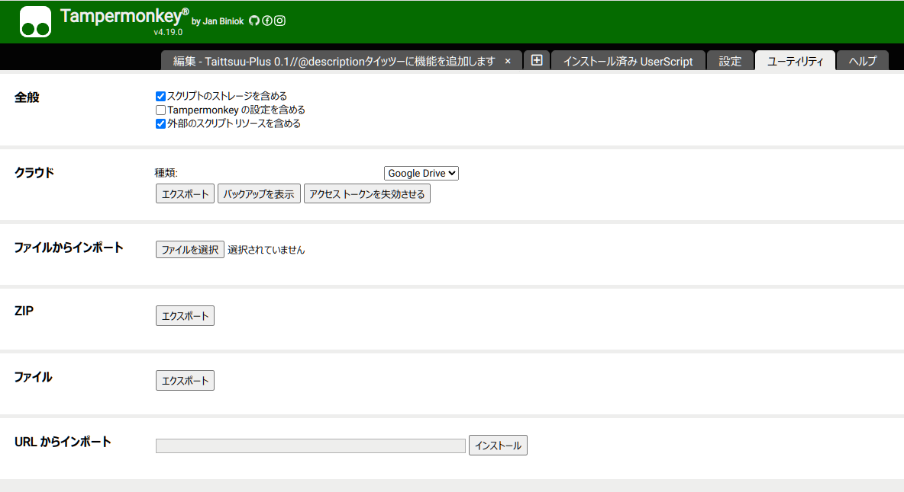

# タイッツー Plus

作者: [いかそば](https://taittsuu.com/users/ikasoba000)

タイッツー Plus は tampermonkey で動くユーザースクリプトです。
もしかしたら greasemonkey でも動くかもしれないです。

# 目次

- [タイッツー Plus の機能](#タイッツー-plus-の機能)
- [インストール・アップデート方法（パソコン）](#インストール・アップデート方法-パソコン)
- [インストール・アップデート方法（スマホ）](#インストール・アップデート方法-スマホ)

# タイッツー Plus の機能

## リンク

  URL っぽい文字列をリンクへ変換

## メンションリンク

  `@ikasoba000` などの文字をリンクへ変換

## 画像プレビュー

  `.png`や`.webp`などの拡張子が付いた URL を画像として展開

## タイーツ展開

  タイーツの URL を展開します

## リタイーツ

## 太字

  `**` で囲った文字は太くなります

## 斜字

  `__` で囲った文字は斜めになります

## テーマ

  ダークテーマとライトテーマのどちらかが選べます

## タイツの色の変更

  以下の絵文字のどれかをユーザー名に入れると、タイツがその色になります。

  | 絵文字 | 色       |
  | ------ | -------- |
  | 🔴     | 赤       |
  | 🟠     | オレンジ |
  | 🟡     | 黄色     |
  | 🟢     | 緑       |
  | 🔵     | 青       |
  | 🟣     | 紫       |
  | 🟤     | 茶色     |
  | 🏴     | 黒       |
  | 🏳️     | 白       |

# インストール・アップデート方法 (パソコン)

- まず、[tampermonkey](https://www.tampermonkey.net/) 拡張機能をブラウザにインストールします。

- 次に拡張機能アイコンから tampermonkey のダッシュボードを開きます。

  

- 次にユーティリティタブを開きます。

  

  `URLからインポート`の入力欄へ以下の URL を貼り付け、インストールボタンを押します。

  https://ikasoba.github.io/taittsuu-plus/index.js

# インストール・アップデート方法 (スマホ)

- まず、 [Stay](https://apps.apple.com/jp/app/stay-safari-companion/id1591620171) というアプリを入れます。

  

- `Enable Stay Safari Extension.`から、指示に従って拡張機能を有効にします。

  - `Tap Here Open Safari` Safari を開きます。
  - `ぁぁ`ボタンから`拡張機能を管理` -> `Stay`を有効化

- `Stay`アプリに戻り、`I am all experienced user, skip for now.`を押す。
- 警告は`OK`ボタンを押して無視

- 以下の URL を開く

  https://ikasoba.github.io/taittsuu-plus/index.js

  

- `Tap to install`というボタンがあるので押す

- `Stayで開きますか？`と聞かれるので`開く`と答える

- 右上の`作成ボタン`を押す

- `installed`とでるので閉じる

- これで完了！
